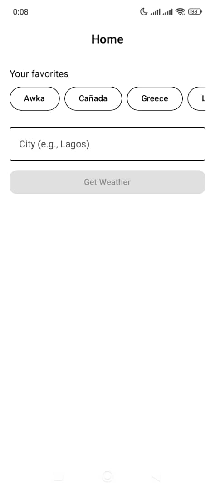
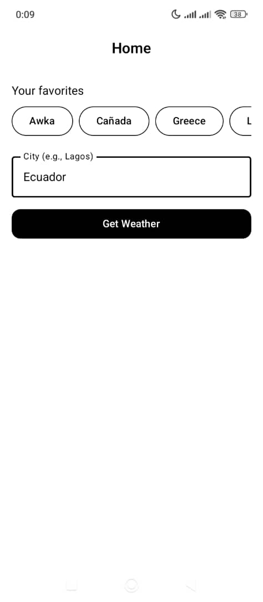
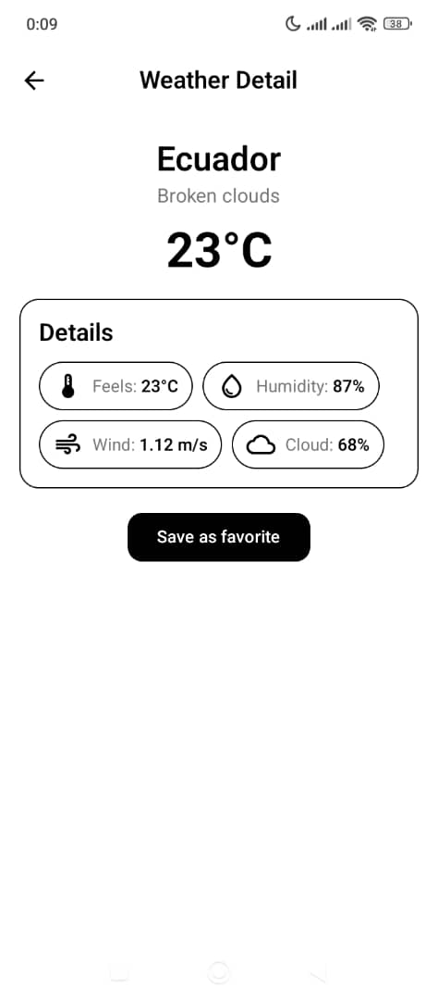
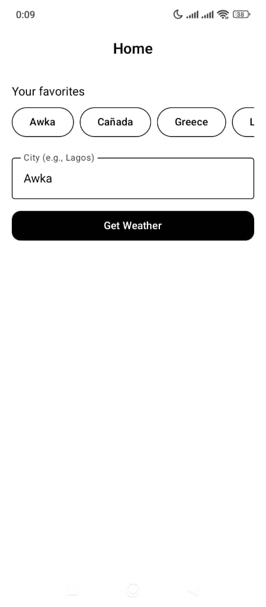
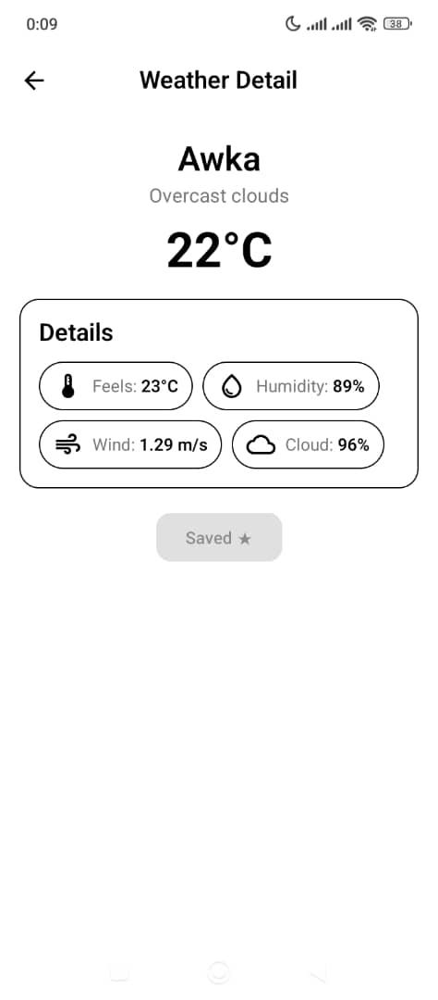

# OpenWeather (Android • Jetpack Compose)

A clean MVVM weather app that fetches current conditions from OpenWeather and lets users save multiple favorite cities. Built with Kotlin, Compose, Hilt (DI), Retrofit, and DataStore. Connectivity is checked **before** triggering network calls to improve UX.

## ✨ Features
- Splash → Home → Detail navigation
- Search by city (e.g., `Lagos`)
- Detail screen shows description + temperature + key metrics
- Save multiple favorites (DataStore) and reuse them from Home
- Connectivity check in UI: if offline, we avoid the call and inform the user
- Clean architecture (MVVM + use cases + repository)
- Dependency Injection with Hilt
- Unit tests for repository, use case, viewmodel, and DataStore favorites

## 📸 Screenshots
| Splash                      | Home (empty) | Home (typed, not favorite) |
|-----------------------------|---|---|
|  |  |  |

| Detail | Home (favorite chip) | Home (favorite typed)                                        |
|---|---|--------------------------------------------------------------|
|  |  |  |

## 🧱 Architecture

- **MVVM** with `StateFlow<Resource<T>>` (Idle → Loading → Success/Error).
- **DI** via Hilt (`@HiltAndroidApp`, modules for Retrofit/Repo/UseCase).
- **SOLID**: clear responsibilities and interfaces at each layer.

## 🧪 Tests
Fast JVM unit tests (no real network/UI):
- **Repository**: MockWebServer verifies correct endpoint/params and JSON parsing; error cases (404) covered.
- **Use Case**: verifies success passthrough and error propagation.
- **ViewModel**: verifies emissions `Idle → Loading → Success/Error` using Turbine; handles error messages from API.
- **DataStore favorites**: add/remove + case-insensitive de-dup + sorted list (Robolectric).

